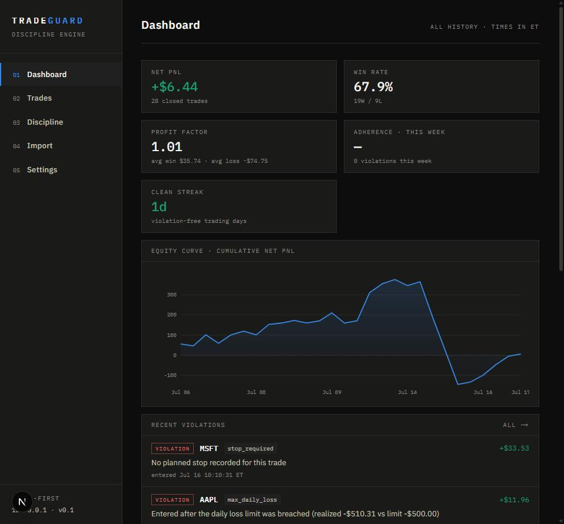
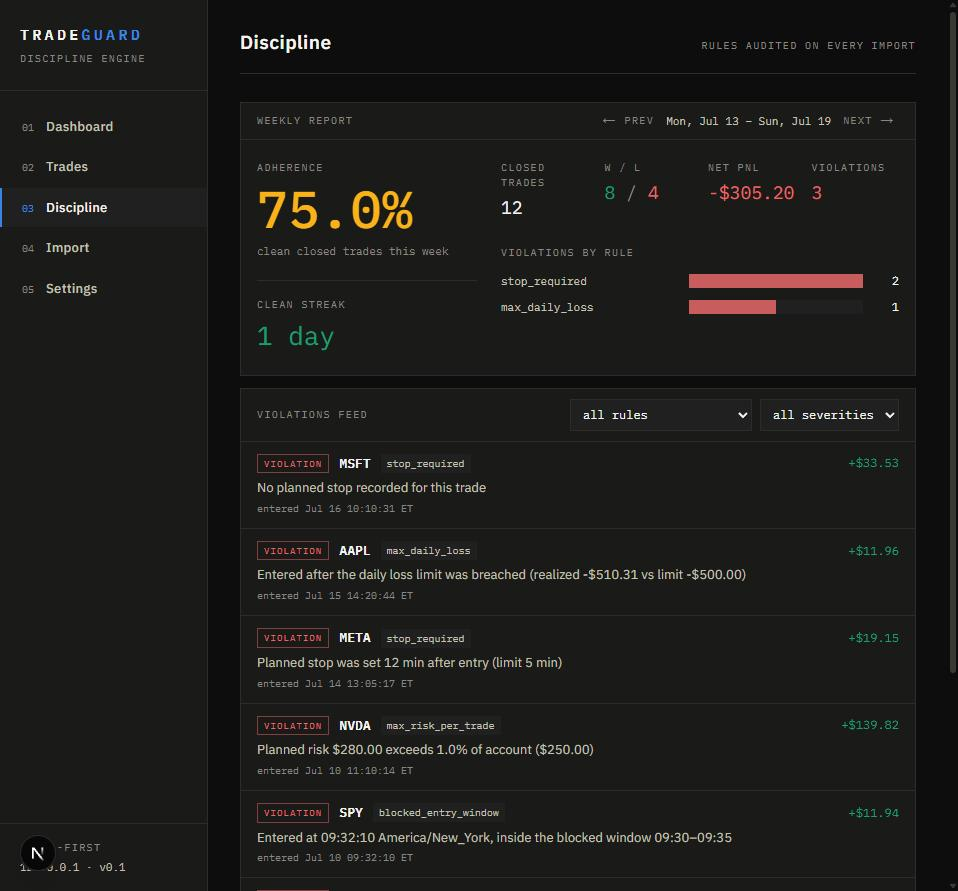
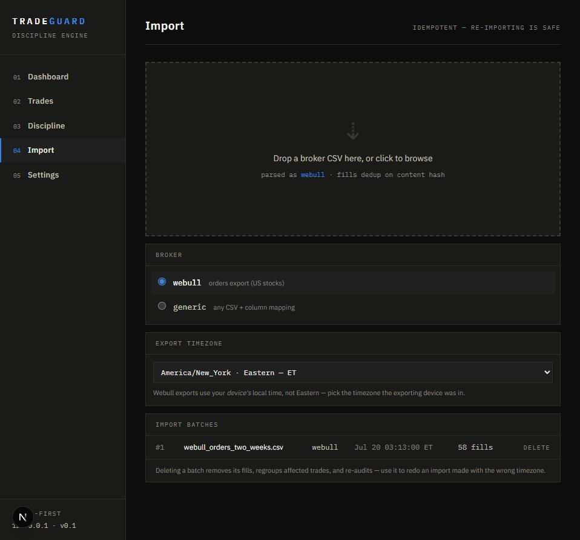

# TradeGuard

[](https://github.com/gunna17671672/tradeguard/actions/workflows/ci.yml)

**A self-hosted trading journal that enforces your trading plan, not just records it.**

Most journals show you what happened after the fact — win rate, PnL, an equity curve — and leave discipline entirely up to you. TradeGuard does the stats too (FIFO trade reconstruction from raw fills, profit factor, expectancy, PnL calendar), but its actual job is the **discipline engine**: you write your trading rules once, in a plain YAML file — max trades per day, stops required within N minutes, no revenge trades, entries blocked during the opening chop — and every import is audited against them automatically. Violations show up attached to the exact trade that caused them, on a dashboard, not buried three tabs deep in a spreadsheet you'll stop opening by February.

Local-first: one container, your machine, your SQLite file. Nothing phones home.

## Screenshots

| Dashboard | Discipline | Import |
|---|---|---|
| [](docs/screenshots/dashboard.jpg) | [](docs/screenshots/discipline.jpg) | [](docs/screenshots/import.jpg) |

All three are generated from the [bundled sample dataset](#load-the-sample-dataset) below, never from a real account.

**Status:** Milestones 1–4 are complete — data core (grouping engine, FIFO lot matching, Webull + generic importers, CLI), discipline engine (six built-in rules, adherence scoring, weekly reports), the FastAPI + Next.js web UI, and packaging (single-container Docker image, CI, this README). See [SPEC.md](SPEC.md) for the full roadmap; Milestone 5 (more importers, a TradingView webhook receiver) is next.

## Quickstart

### Docker

```bash
docker build -t tradeguard .
docker run -p 8080:8080 -v tradeguard_data:/data tradeguard
```

Open <http://localhost:8080>. Everything mutable — the SQLite database and your `rules.yaml` (seeded from the template on first start) — lives on the `tradeguard_data` volume; the image itself is stateless, so `docker rm`-ing the container never loses data and pulling a new image is a safe upgrade.

No local Docker install is required to *verify* the image builds — [`.github/workflows/ci.yml`](.github/workflows/ci.yml) builds it on every push (see the badge above); it's the packaging test in place of a local `docker build`.

### Dev mode

Two processes: FastAPI on **:8000**, Next.js on **:3000**. Requires Python 3.11+ and Node 20+.

```bash
# Terminal 1 — API
cd backend
python -m venv .venv
# Windows: .venv\Scripts\activate    macOS/Linux: source .venv/bin/activate
pip install -e ".[dev]"
uvicorn app.main:app --reload

# Terminal 2 — web UI
cd frontend
npm install        # first time only
npm run dev
```

Open <http://localhost:3000>. The frontend talks to the API at `http://127.0.0.1:8000` (override with `NEXT_PUBLIC_API_URL`); the backend allows the dev origin via CORS. Interactive API docs live at <http://127.0.0.1:8000/docs>. The API resolves its SQLite database from `TRADEGUARD_DB` (default: `tradeguard.db` next to the `backend` package, independent of the launch directory) and its rules from `TRADEGUARD_RULES` (default: the nearest `rules.yaml` walking up from the working directory).

## Load the sample dataset

New install, empty dashboard? Load the bundled two-week synthetic dataset — mixed wins and losses across eight symbols, with violations spanning all six built-in rules, not just one:

```bash
# Dev mode (from backend/, venv active)
python -m app.cli sample

# Docker — runs against the same volume the server uses
docker run --rm -v tradeguard_data:/data tradeguard python -m app.cli sample
```

It's idempotent (safe to re-run) and fully synthetic — see [`sample_data/`](sample_data/) and [`backend/app/sample.py`](backend/app/sample.py). Delete its batch from the Import page whenever you want a clean slate for your own data.

You can also import your own broker CSV, from the Import page or the CLI:

```bash
python -m app.cli import my_orders.csv --broker webull
python -m app.cli import fills.csv --broker generic --mapping mapping.json   # any CSV, custom columns
```

A generic `mapping.json` names your CSV's columns and time handling:

```json
{
  "symbol": "Ticker", "side": "Action", "qty": "Shares",
  "price": "FillPrice", "fees": "Commission", "executed_at": "When",
  "datetime_format": "%m/%d/%Y %H:%M:%S", "timezone": "America/New_York"
}
```

Imports are idempotent (re-importing the same file is safe — fills dedup on content hash) and audited against `rules.yaml` automatically. Imported the wrong file, or the wrong timezone? Delete the batch from the Import page (or `DELETE /api/imports/{id}`) — it reverts the fills, regroups affected trades, and re-audits.

## Configuring your rules

Your discipline rules live in `rules.yaml` at the repo root (Docker: `/data/rules.yaml`). That file is **yours** — it holds your real account size and is rewritten when you save from the Settings page — so it's gitignored and never committed. The checked-in template is [`rules.example.yaml`](rules.example.yaml); it's copied to `rules.yaml` automatically on first run if none exists.

```yaml
account:
  account_size: "25000"        # quote money so YAML keeps it exact
  timezone: America/New_York   # optional; default shown
  r_value: "150"               # optional; dollars per 1R, needed for max_daily_loss's `r:` param

rules:
  max_trades_per_day:
    n: 6
  stop_required:
    within_minutes: 5
    severity: warn              # optional: info/warn skip the adherence score; default is `violation`
  revenge_trade:
    enabled: false               # optional: keep params, disable the rule
    cooldown_minutes: 15
    size_multiplier: "1.5"
```

A rule is enabled by being listed. Every rule body accepts the reserved keys `enabled` and `severity` alongside its own params.

| Rule | Params | Checks |
|---|---|---|
| `max_trades_per_day` | `n` (int) | No more than `n` round-trip trades entered per session day. |
| `stop_required` | `within_minutes` (int) | `planned_stop` must be recorded, and set within N minutes of entry. |
| `max_risk_per_trade` | `pct_of_account` (%) | Planned risk (`\|entry − stop\| × size`) may not exceed this % of `account_size`. No-ops without a planned stop — `stop_required` is what flags that. |
| `blocked_entry_window` | `start`, `end` (`HH:MM`) | No entries inside this window, evaluated in the account timezone. Half-open: an entry at exactly `end` is allowed. |
| `revenge_trade` | `cooldown_minutes` (int), `size_multiplier` | Re-entering within the cooldown after a losing close, at ≥ `size_multiplier` × the losing trade's size, is flagged. |
| `max_daily_loss` | `amount` (dollars) **or** `r` (R multiples, requires `account.r_value`) | Once realized PnL for the session day is at or below the (negative) limit, every later entry that day is flagged. |

**Adherence score:** % of closed trades with zero violations this week, plus the current violation-free streak in days — both computed from `GET /api/reports/weekly`.

## Development

```bash
cd backend
pytest -q                      # tests — must be green before any commit
ruff check . && ruff format .  # lint/format

cd frontend
npm run build                  # type-checks and builds the static export
```

CI (`.github/workflows/ci.yml`) runs the backend suite and a full Docker build on every push.

## Battle-tested against real exports

The Webull importer was built against three *different* real column layouts, discovered by actually exporting from the app and hitting parse failures — not guessed from documentation:

1. **Fills export** — `Symbol, Side, Filled, Avg Price, Filled Time`.
2. **Order-history export** — `Qty` + `Filled Qty` (only fully/partially filled rows import; a partial fill uses the filled quantity, not the order size), plus separate `commission`/`fee` columns.
3. **Paper-account order-history export** — a third layout entirely (`Quantity, Fill price, Status, Commission, Placing time, Closing time, ...`), exchange-prefixed symbols (`NASDAQ:AAPL`) that get normalized, and no filled-quantity column at all — so a partial fill is rejected rather than guessed at.

All three are auto-detected from the header, with unrecognized columns failing loudly (found-vs-expected, both layouts listed) rather than silently mis-parsing. A separate real-world finding: Webull writes timestamps in the *exporting device's* local time, not Eastern — regular-hours market orders showing fill times outside 9:30–4:00 ET was the tell. Every import now takes an explicit `export_timezone`, and a bad guess is fully recoverable: deleting the batch reverts its fills, regroups affected trades, and re-audits, so you can just re-import with the right zone.

## Roadmap

Beyond Milestone 5's importers and webhook receiver ([SPEC.md](SPEC.md)):

- **Multi-account support** — paper vs. real as first-class separate books, not just an `account_label` string.
- **Planned-stop inference from cancelled bracket orders** — a cancelled stop-loss leg in the export is strong evidence of what the plan actually was; use it instead of requiring manual annotation.
- **More broker importers** — IBKR Flex, Schwab/thinkorswim (tracked in SPEC.md's Milestone 5).
- **Remember the last-used import timezone** — so a Phoenix trader doesn't have to reselect `America/Phoenix` on every single import.

## License

[MIT](LICENSE)
